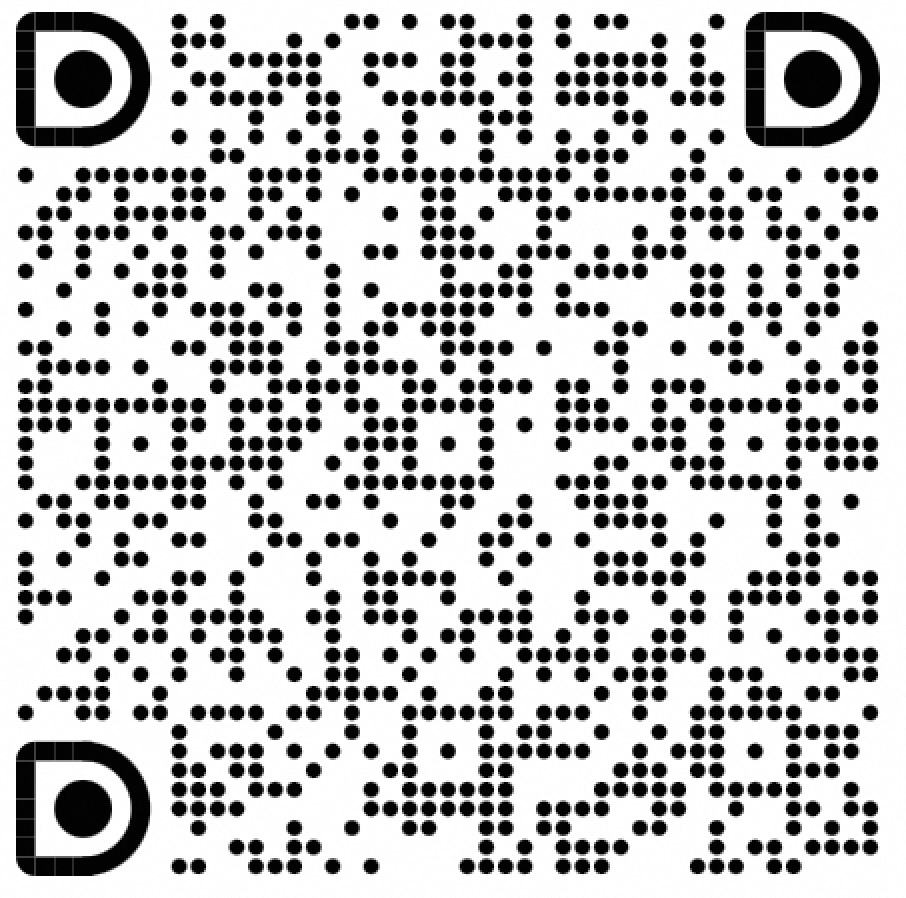
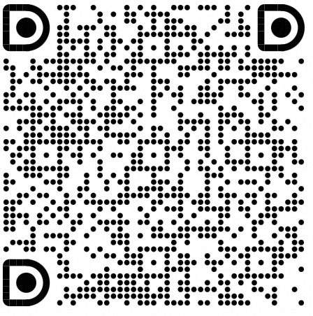

# LongSuite Java Agent

## Introduction
Loongsuite Java Agent is a key component of LoongSuite, Alibaba's unified observability data collection suite, providing instrumentation for Java applications.

LoongSuite includes the following key components:
* [LoongCollector](https://github.com/alibaba/loongcollector): universal node agent, which prodivdes log collection, prometheus metric collection, and network and security collection capabilities based on eBPF.
* [LoongSuite Java Agent](https://github.com/alibaba/loongsuite-java-agent): a process agent providing instrumentaion for java applications.
* [LoongSuite Python Agent](https://github.com/alibaba/loongsuite-python-agent): a process agent providing instrumentaion for python applications.
* [LoongSuite Go Agent](https://github.com/alibaba/loongsuite-go-agent): a process agent for golang with compile time instrumentation.
* Other upcoming language agent.

Loongsuite Java Agent is also a customized distribution of upstream [OTel Java Agent](https://github.com/open-telemetry/opentelemetry-java-instrumentation), with enhanced support for Alibaba extensions and popular AI agent framework.

## Supported libraries, frameworks, and application servers

We support an impressively huge number
of [libraries and frameworks](docs/supported-libraries.md#libraries--frameworks) and
a majority of the most
popular [application servers](docs/supported-libraries.md#application-servers)...right out of the
box!
[Click here to see the full list](docs/supported-libraries.md) and to learn more about
[disabled instrumentation](docs/supported-libraries.md#disabled-instrumentations)
and how to [suppress unwanted instrumentation][suppress].

## Supported extensions

[Extensions](examples/extension/README.md) add new features and capabilities to the agent without
having to create a separate distribution or to fork this repository. For example, you can create
custom samplers or span exporters, set new defaults, and embed it all in the agent to obtain a
single jar file.

- **[DemoIdGenerator](examples/extension/src/main/java/com/example/javaagent/DemoIdGenerator.java)** - Custom trace and span ID generation
- **[DemoPropagator](examples/extension/src/main/java/com/example/javaagent/DemoPropagator.java)** - Custom context propagation across service boundaries
- **[DemoSampler](examples/extension/src/main/java/com/example/javaagent/DemoSampler.java)** - Custom sampling strategies for trace collection
- **[DemoSpanProcessor](examples/extension/src/main/java/com/example/javaagent/DemoSpanProcessor.java)** - Custom span processing and enrichment
- **[DemoSpanExporter](examples/extension/src/main/java/com/example/javaagent/DemoSpanExporter.java)** - Custom telemetry export destinations
- **[DemoAutoConfigurationCustomizerProvider](examples/extension/src/main/java/com/example/javaagent/DemoAutoConfigurationCustomizerProvider.java)** - Custom agent configuration customization
- **[DemoPropagator](examples/extension/src/main/java/com/example/javaagent/DemoPropagator.java)** - Custom context propagation implementation
- **[DemoServlet3InstrumentationModule](examples/extension/src/main/java/com/example/javaagent/instrumentation/DemoServlet3InstrumentationModule.java)** - Additional instrumentation for specific framework

These examples serve as templates for creating your own custom extensions.

## Troubleshooting

To turn on the agent's internal debug logging:

`-Dotel.javaagent.debug=true`

**Note**: These logs are extremely verbose. Enable debug logging only when needed.
Debug logging negatively impacts the performance of your application.

## Community

We are looking forward to your feedback and suggestions. You can join
our [DingTalk user group](https://qr.dingtalk.com/action/joingroup?code=v1,k1,VaFSqbGiRY0iAL3GGd18DRWDyb1HpgOuyfDzsX3Drng=&_dt_no_comment=1&origin=11?) and [DingTalk developer group](https://qr.dingtalk.com/action/joingroup?code=v1,k1,p++Tn/fCshqbhFYK69wXUPUyQ6+W15jxiyfiicfdNPw=&_dt_no_comment=1&origin=11?)
to engage with us.

| User Group              | Developer Group           |
|-------------------------|---------------------------|
|  |  |

## Resoures
* AgentScope: https://github.com/modelscope/agentscope
* Observability Community: https://observability.cn

[suppress]: https://opentelemetry.io/docs/zero-code/java/agent/disable/
